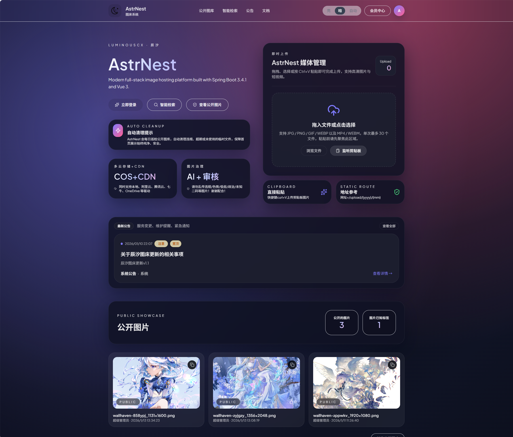
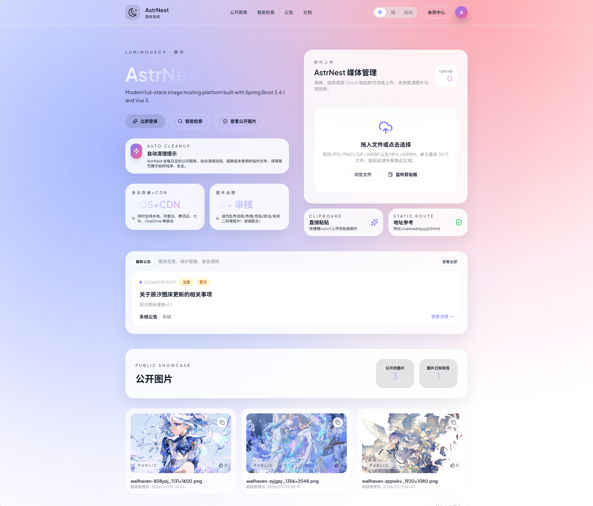

# AstrNest 媒体管理系统
<div>

现代全栈媒体管理平台，基于 Spring Boot 3.4.1 和 Vue 3 构建。多云存储、AI内容审查、完整API生态。

<p align="center">
  <a href="https://github.com/vuejs/core">
    
  </a>
  <a href="https://github.com/element-plus/element-plus">
    
  </a>
  <a href="https://spring.io/projects/spring-boot">
    
  </a>
  <a href="https://github.com/luminous-ChenXi/astrnest/blob/master/LICENSE">
    
  </a>
  <a href="https://github.com/luminous-ChenXi/astrnest/releases">
    
  </a>
</p>
<p align="center">
  简体中文 · <a href="./README_EN.md">English</a>
</p>
<p align="center">
  <a href="#quick-start">快速开始</a> · 
  <a href="https://luminouschenxi.com">博客</a> · 
  <a href="#tech-stack">技术栈</a> · 
  <a href="#acknowledgments">致谢</a> ·   
  <a href="https://discord.gg/hBsqcfwC9Q">Discord</a> · 
  <a href="https://github.com/luminous-ChenXi/astrnest">GitHub</a>
</p>

</div>


<div align="center">

# AstrNest

_Modern full-stack image hosting platform built with Spring Boot 3.4.1 and Vue 3._

 唯有青春与梦想不可辜负~！

</div>

---

## Core Features | 核心特性

- **现代化架构**: Spring Boot 3.4.1 + Vue 3 + Vite 5 全栈技术栈
- **多角色权限**: 支持管理员、普通用户等多级权限管理体系
- **多云存储**: 内置 Local、阿里云 OSS、腾讯 COS、七牛 Kodo、华为 OBS、金山 KS3、又拍云 USS、OneDrive/SharePoint 以及通用 S3 驱动，可在配置中一键切换；S3 兼容驱动默认 5GB 阈值触发 25MB 分片上传，支持 CDN/CNAME、加速域、PathStyle 以及预签名直传凭证
- **智能内容审查**: 接入腾讯云数据万象（COS CI）图片审核与标签服务，自动回填 AI 决策/标签/RequestId，并结合错误码文档输出友好提示，配合人工复核双重保障
- **完整的API生态**: RESTful API + API密钥认证 + Web管理界面
- **灵活的存储方案**: 支持本地存储与云对象存储（OSS/COS）
- **安全管理**: Spring Security 6 + JWT认证 + 内容安全策略
- **成员治理与配额**: 管理端“成员列表”支持查看头像/配额/点赞总数，并可一键调整每日上传与总存储额度、切换管理员/用户/游客角色
- **响应式设计**: 现代化UI组件库，支持PC端、移动端、平板端等多端适配
- **实时监控**: 系统运行状态监控与操作日志审计
- **邮件服务**: 集成邮件模板与验证码发送功能，默认预置阿里云邮局 SMTP
<p align="center">
  <b>🎨 主题预览 | Theme Preview</b>
</p>

<table align="center">
  <tr>
    <td align="center" width="50%">
      
      <br>
      <sub><b>🌙 Dark Mode</b></sub>
    </td>
    <td align="center" width="50%">
      
      <br>
      <sub><b>☀️ Light Mode</b></sub>
    </td>
  </tr>
</table>

## License Warning | GPL v3 开源协议警示
### ⚠️ **重要许可提醒** ⚠️

**本项目采用 GNU General Public License v3 (GPL v3) 协议开源**

### 法律声明：
- **任何使用、修改、分发本代码的行为都必须遵守 GPL v3 协议**
- **基于本项目的衍生作品必须同样以 GPL v3 协议开源**
- **禁止将本代码用于闭源商业项目**
- **禁止移除版权信息和许可声明**

### 对不良开发人员的警告：
**请注意：以下行为将构成侵权并可能面临法律责任：**
- ❌ 私自修改协议或移除版权声明
- ❌ 将代码用于闭源商业产品而不开源
- ❌ 声称代码为自己原创
- ❌ 绕过 GPL 协议要求分发衍生作品

### 您的义务：
- ✅ 保留原始版权和许可信息  
- ✅ 基于本项目的修改必须同样开源  
- ✅ 分发时必须提供源代码  
- ✅ 明确标识修改内容和修改者

**此项目开发周期3个月，开发时间较长，由辰汐团队自主开发，其开发过程艰辛；违反 GPL 协议将面临法律追责，请尊重开源精神！**

## Tech Stack | 技术栈

### 后端
- **框架**: Spring Boot 3.4.1
- **语言**: Java 21
- **数据库**: MySQL 5.7+/8.0
- **安全**: Spring Security 6
- **文档**: SpringDoc OpenAPI 3
- **AI 审核 SDK**: Tencent Cloud COS CI (`com.qcloud:cos_api`)
- **构建**: Maven Wrapper

### 前端
- **框架**: Vue 3.5.24
- **构建**: Vite 5.4.10
- **路由**: Vue Router 4
- **状态管理**: Pinia 3
- **UI组件**: Element Plus 2.8.6
- **样式**: Tailwind CSS 3
- **图标**: Lucide Vue, Element Plus Icons

## System Architecture | 系统架构

### 架构图
AstrNest 采用前后端分离架构：

- **前端**: Vue 3 + Vite + Element Plus + Tailwind CSS
- **后端**: Spring Boot 3 + Spring Security + JPA + MySQL
- **认证**: JWT Token + API Key 双重认证机制
- **存储**: 本地存储 + 云对象存储扩展支持
- **安全**: 基于角色的权限控制 + 内容安全策略

### 项目结构

```
astrnest/
├─ backend/      # Spring Boot 服务：REST API、鉴权、内容审查、API 密钥管理
├─ frontend/     # Vue 3 + Vite 单页应用：仪表盘、上传中心、安全控制台、API 集成
└─ storage/      # （运行时生成）本地存储目录，可通过配置改为 OSS/COS
```

## API Documentation | API 接口文档概览

### Swagger / OpenAPI
- 在线文档入口：`/swagger-ui/index.html`
- OpenAPI JSON：`/v3/api-docs`
- 认证方式：登录后获取的 Token 放入 `Authorization: Bearer <token>`，部分接口需管理员权限。

## Quick Start | 快速开始（开发）

这里以Ubuntu本地开发为例：

1) 克隆与依赖
```bash
git clone https://github.com/luminous-ChenXi/AstrNest.git
cd AstrNest
```
2) 初始化数据库（本地 MySQL）
```bash
mysql -u root -p < backend/db/init.sql
```
3) 启动后端
```bash
cd backend
./mvnw spring-boot:run
```
4) 启动前端（新终端）
```bash
cd frontend
npm install
npm run dev
```
5) 访问
- 前端：http://localhost:5173
- 后端：http://localhost:8080
- API 文档：http://localhost:8080/swagger-ui/index.html

**默认管理员**：`admin` / `chenxi123`（请务必修改）。

> 如果你想直接看配置细节（环境变量、文件路径、初始化脚本、FFmpeg、存储切换等），请跳转 `CONFIG_GUIDE.md`。

### 部署概览
- **Docker Compose（推荐）**：复制 `.env.example` → `.env`，填好数据库/域名/SMTP/存储，再执行：
```bash
docker compose --env-file .env up -d
```
- **传统部署**：`backend` 打包 `./mvnw clean package && java -jar target/backend-0.0.1-SNAPSHOT.jar`；`frontend` 运行 `npm run build` 后将 `dist/` 交给 Nginx/CDN。

更详细的环境变量、Nginx 反代、CDN/对象存储切换请查看 `CONFIG_GUIDE.md`。

## Problem Solving | 问题解决

| 问题 | 处理建议 |
| --- | --- |
| CORS 报错 | 确保后端 `SecurityConfig` 中的 CORS 白名单包含当前前端域名，或在部署入口层（Nginx）补充 `Access-Control-*` 头。 |
| 数据库认证失败 | 检查 `spring.datasource.username/password` 与 MySQL 用户授权是否一致。 |
| API 上传 401 | `POST /api/uploads` 需要登录管理员或携带有效 `X-API-Key`。在安全中心/API 页面创建密钥。 |
| 静态资源访问不到 | 若切换对象存储，记得同步配置 `astrnest.storage.local.public-base-url` 或在后台设置资产域名，并确保 CDN/桶权限正确。 |
| 邮件发送失败 | 检查邮件配置是否正确，包括SMTP服务器、端口、用户名和密码 |
| 验证码验证失败 | 确保验证码在有效期内，且输入正确 |

### 常用脚本
- 后端开发：`cd backend && ./mvnw spring-boot:run`
- 后端测试：`cd backend && ./mvnw test`
- 前端开发：`cd frontend && npm run dev`
- 前端构建：`cd frontend && npm run build`

### API 快速示例
```bash
# 登录
curl -X POST "http://localhost:8080/api/auth/login" \
  -H "Content-Type: application/json" \
  -d '{"username":"admin","password":"chenxi123"}'

# 上传（API Key）
curl -X POST "http://localhost:8080/api/uploads" \
  -H "X-API-Key: <your-api-key>" \
  -F "file=@/path/to/image.jpg"
```

## Development Roadmap | 开发路线图
- ~~添加图片人工审核功能，支持手动审核图片违规情况~~ ✅
- ~~添加AI图片违规查询功能，支持批量查询图片违规情况~~ ✅
- ~~完善图片Tag标签功能，支持批量添加、删除、搜索~~ ✅
- ~~支持更多云存储提供商（阿里云OSS、腾讯云COS等）~~ ✅
- [ ] 代码小白友好型初始化页面
- [ ] 图片压缩和格式转换功能
- [ ] 图片水印添加功能
- [ ] 图片批量处理工具
- [ ] 移动端应用开发
- [ ] 第三方登录集成

## Acknowledgments | 致谢

### 开源组件合规声明
本项目基于众多优秀的开源组件构建，感谢开源社区的贡献！以下是按前端/后端列出主要依赖组件及其许可证信息，便于合规排查：

#### 前端（参考/frontend/package.json）
- **Vue 3** [`vue@^3.5.24`](https://github.com/vuejs/core) - [MIT License](https://github.com/vuejs/core/blob/main/LICENSE)
- **Vue Router** [`vue-router@^4.6.3`](https://github.com/vuejs/router) - [MIT License](https://github.com/vuejs/router/blob/main/LICENSE)
- **Pinia** [`pinia@^3.0.4`](https://github.com/vuejs/pinia) - [MIT License](https://github.com/vuejs/pinia/blob/main/LICENSE)
- **Element Plus** [`element-plus@^2.8.6`](https://github.com/element-plus/element-plus) - [MIT License](https://github.com/element-plus/element-plus/blob/dev/LICENSE)
- **Element Plus Icons** [`@element-plus/icons-vue@^2.3.1`](https://github.com/element-plus/element-plus-icons) - [MIT License](https://github.com/element-plus/element-plus-icons/blob/main/LICENSE)
- **Vite** [`vite@^5.4.10`](https://github.com/vitejs/vite) - [MIT License](https://github.com/vitejs/vite/blob/main/LICENSE)
- **Vue Plugin** [`@vitejs/plugin-vue@^5.1.4`](https://github.com/vitejs/vite-plugin-vue) - [MIT License](https://github.com/vitejs/vite-plugin-vue/blob/main/LICENSE)
- **Tailwind CSS** [`tailwindcss@^3.4.17`](https://github.com/tailwindlabs/tailwindcss) - [MIT License](https://github.com/tailwindlabs/tailwindcss/blob/master/LICENSE)
- **Autoprefixer** [`autoprefixer@^10.4.22`](https://github.com/postcss/autoprefixer) - [MIT License](https://github.com/postcss/autoprefixer/blob/main/LICENSE)
- **PostCSS** [`postcss@^8.5.6`](https://github.com/postcss/postcss) - [MIT License](https://github.com/postcss/postcss/blob/main/LICENSE)
- **Axios** [`axios@^1.7.7`](https://github.com/axios/axios) - [MIT License](https://github.com/axios/axios/blob/main/LICENSE)
- **Day.js** [`dayjs@^1.11.13`](https://github.com/iamkun/dayjs) - [MIT License](https://github.com/iamkun/dayjs/blob/dev/LICENSE)
- **DOMPurify** [`dompurify@^3.3.0`](https://github.com/cure53/DOMPurify) - [Apache License 2.0](https://github.com/cure53/DOMPurify/blob/main/LICENSE)
- **Marked** [`marked@^12.0.2`](https://github.com/markedjs/marked) - [MIT License](https://github.com/markedjs/marked/blob/master/LICENSE)
- **GSAP** [`gsap@^3.12.5`](https://github.com/greensock/GSAP) - [Standard 'No Charge' License](https://github.com/greensock/GSAP/blob/master/LICENSE)
- **Lucide Icons** [`lucide-vue-next@^0.555.0`](https://github.com/lucide-icons/lucide) - [ISC License](https://github.com/lucide-icons/lucide/blob/main/LICENSE)
- **Plyr** [`plyr`](https://github.com/sampotts/plyr) - [MIT License](https://github.com/sampotts/plyr/blob/master/LICENSE.md)

#### 后端（参考/backend/pom.xml）
- **Spring Boot 3.4.1** - [Apache License 2.0](https://github.com/spring-projects/spring-boot/blob/main/LICENSE.txt)
  - spring-boot-starter-web
  - spring-boot-starter-security  
  - spring-boot-starter-data-jpa
  - spring-boot-starter-validation
  - spring-boot-starter-mail
  - spring-boot-starter-actuator
  - spring-boot-starter-test
- **SpringDoc OpenAPI** [`springdoc-openapi-starter-webmvc-ui@2.7.0`](https://github.com/springdoc/springdoc-openapi) - [Apache License 2.0](https://github.com/springdoc/springdoc-openapi/blob/master/LICENSE)
- **Jackson** [`jackson-datatype-jsr310`](https://github.com/FasterXML/jackson) - [Apache License 2.0](https://github.com/FasterXML/jackson/blob/master/LICENSE)
- **MySQL Connector/J** - [GPL License with FOSS License Exception](https://github.com/mysql/mysql-connector-j/blob/release/8.x/LICENSE)
- **AWS SDK S3** [`software.amazon.awssdk:s3@2.25.58`](https://github.com/aws/aws-sdk-java-v2) - [Apache License 2.0](https://github.com/aws/aws-sdk-java-v2/blob/master/LICENSE.txt)
- **阿里云 OSS SDK** [`com.aliyun.oss:aliyun-sdk-oss@3.17.4`](https://github.com/aliyun/aliyun-oss-java-sdk) - [Apache License 2.0](https://github.com/aliyun/aliyun-oss-java-sdk/blob/master/LICENSE)
- **腾讯云 COS SDK** [`com.qcloud:cos_api@5.6.255.1`](https://github.com/tencentyun/cos-java-sdk-v5) - [MIT License](https://github.com/tencentyun/cos-java-sdk-v5/blob/master/LICENSE)
- **又拍云 Java SDK** [`com.upyun:java-sdk@4.2.3`](https://github.com/upyun/java-sdk) - [MIT License](https://github.com/upyun/java-sdk/blob/master/LICENSE)
- **Lombok** - [MIT License](https://github.com/projectlombok/lombok/blob/master/LICENSE)
- **Spring Boot Configuration Processor** - [Apache License 2.0](https://github.com/spring-projects/spring-boot/blob/main/LICENSE.txt)
- **H2 Database** (test) - [MPL 2.0 / EPL 1.0](https://github.com/h2database/h2database/blob/master/LICENSE.txt)
- **Spring Security Test** (test) - [Apache License 2.0](https://github.com/spring-projects/spring-security/blob/main/LICENSE.txt)

#### 免责声明
- 以上许可证信息基于各组件官方仓库的最新信息
- 具体版本可能随项目更新而变化
- 使用本项目时请确保遵守所有依赖组件的许可证要求
- 建议在商业使用前进行详细的许可证合规审查


## Contributing | 贡献指南

欢迎贡献代码！请阅读 [CONTRIBUTING.md](CONTRIBUTING.md) 了解详细流程。

## Issue Reporting | 问题报告

如遇问题，请：
1. 查看 [常见问题](#常见问题)
2. 搜索 [GitHub Issues](https://github.com/your-repo/astrnest/issues)
3. 创建新的 Issue（同时欢迎你能够提供宝贵建议！）
4. 查看[联系方式](#contact)

## License | 许可证

本项目基于 [GNU General Public License v3 (GPL v3)](LICENSE) 开源。


## Security | 安全

安全相关问题请查看 [SECURITY.md](SECURITY.md)。


## Contact | 联系方式

- **问题反馈**: 通过GitHub Issues提交
- **邮箱**: chenxi@luminouschenxi.net
- **Discord**: [LuminousChenxi](https://discord.gg/hBsqcfwC9Q)

---
求点赞！求关注！求投喂！
⭐ 如果这个项目对您有帮助，请给我们一个 Star！
