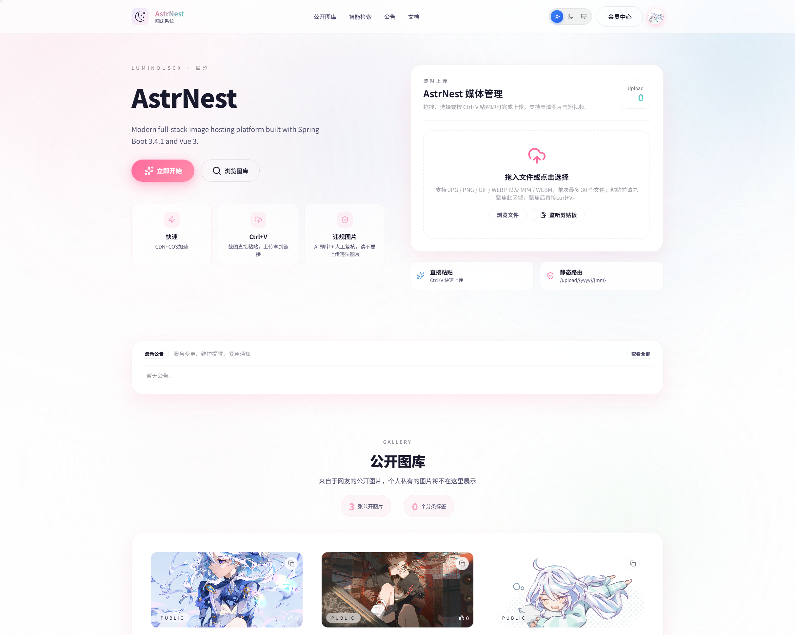
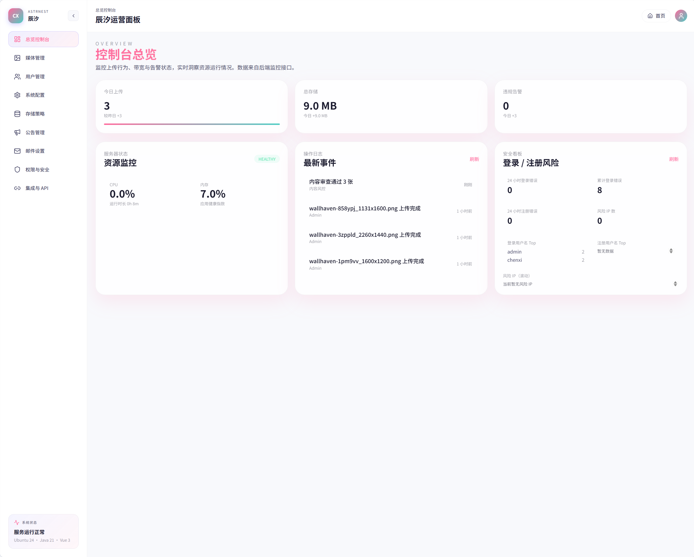

# AstrNest Media Management System
<div>

Modern full-stack media management platform built with Spring Boot 3.4.1 and Vue 3. Multi-cloud storage, AI content moderation, complete API ecosystem.

<p align="center">
  <a href="https://github.com/vuejs/core">
    
  </a>
  <a href="https://github.com/element-plus/element-plus">
    
  </a>
  <a href="https://spring.io/projects/spring-boot">
    
  </a>
  <a href="https://github.com/luminous-ChenXi/astrnest/blob/master/LICENSE">
    
  </a>
  <a href="https://github.com/luminous-ChenXi/astrnest/releases">
    
  </a>
  <a href="https://coderabbit.ai">
    
  </a>
</p>
<p align="center">
  <a href="./README.md">简体中文</a> · English
</p>
<p align="center">
  <a href="#quick-start">Quick Start</a> · 
  <a href="https://luminouschenxi.com">Blog</a> · 
  <a href="#tech-stack">Tech Stack</a> · 
  <a href="#acknowledgments">Acknowledgments</a> ·   
  <a href="https://discord.gg/hBsqcfwC9Q">Discord</a> · 
  <a href="https://github.com/luminous-ChenXi/astrnest_backend">Backend</a>
</p>

</div>


<div align="center">

# AstrNest

_Modern full-stack image hosting platform built with Spring Boot 3.4.1 and Vue 3._

Only youth and dreams are worth living for!

</div>

---

## Core Features

- **Modern Architecture**: Spring Boot 3.4.1 + Vue 3 + Vite 5 full-stack technology stack
- **Multi-role Permissions**: Supports multi-level permission management system for administrators, regular users, and more
- **Multi-cloud Storage**: Built-in Local, Alibaba Cloud OSS, Tencent COS, Qiniu Kodo, Huawei OBS, Kingsoft KS3, Upyun USS, OneDrive/SharePoint, and generic S3 drivers. Switch between them with one click in configuration. S3-compatible drivers default to 5GB threshold triggering 25MB chunked uploads, supporting CDN/CNAME, accelerated domains, PathStyle, and presigned direct upload credentials
- **Intelligent Content Moderation**: Integrated with Tencent Cloud Data Lake (COS CI) image moderation and tagging services, automatically populating AI decisions/tags/RequestId, and providing user-friendly prompts based on error code documentation, combined with manual review for double protection
- **Complete API Ecosystem**: RESTful API + API key authentication + Web management interface
- **Flexible Storage Solutions**: Supports local storage and cloud object storage (OSS/COS)
- **Security Management**: Spring Security 6 + JWT authentication + Content Security Policy
- **Member Governance & Quotas**: Admin "Member List" supports viewing avatars/quotas/total likes, and allows one-click adjustment of daily upload and total storage quotas, switching between admin/user/guest roles
- **Responsive Design**: Modern UI component library, supporting PC, mobile, tablet, and other multi-device adaptation
- **Real-time Monitoring**: System operation status monitoring and operation log auditing
- **Email Service**: Integrated email templates and verification code sending functionality, with Alibaba Cloud Mail SMTP pre-configured by default

<p align="center">
  <b>🎨 Theme Preview</b>
</p>

<table align="center">
  <tr>
    <td align="center" width="50%">
      
      <br>
      <sub><b>User Frontend Homepage</b></sub>
    </td>
    <td align="center" width="50%">
      
      <sub><b>Admin Frontend Homepage</b></sub>
    </td>
  </tr>
</table>

## License Warning | GPL v3 Open Source License Notice
### ⚠️ **Important License Reminder** ⚠️

**This project is open-sourced under the GNU General Public License v3 (GPL v3)**

### Legal Statement:
- **Any use, modification, or distribution of this code must comply with the GPL v3 license**
- **Derivative works based on this project must also be open-sourced under GPL v3**
- **Prohibited from using this code in closed-source commercial projects**
- **Prohibited from removing copyright information and license notices**

### Warning to Unethical Developers:
**Please note: The following actions constitute infringement and may face legal liability:**
- ❌ Privately modifying the license or removing copyright notices
- ❌ Using the code in closed-source commercial products without open-sourcing
- ❌ Claiming the code as your own original work
- ❌ Circumventing GPL license requirements when distributing derivative works

### Your Obligations:
- ✅ Retain original copyright and license information  
- ✅ Modifications based on this project must also be open-sourced  
- ✅ Source code must be provided when distributing  
- ✅ Clearly identify modified content and modifiers

**This project has a development cycle of 3 months, developed independently by the ChenXi team. The development process was arduous; violating the GPL license will result in legal consequences. Please respect the open-source spirit!**

## Tech Stack

### Backend
- **Framework**: Spring Boot 3.4.1
- **Language**: Java 21
- **Database**: MySQL 5.7+/8.0
- **Security**: Spring Security 6
- **Documentation**: SpringDoc OpenAPI 3
- **AI Moderation SDK**: Tencent Cloud COS CI (`com.qcloud:cos_api`)
- **Build**: Maven Wrapper

### Frontend
- **Framework**: Vue 3.5.24
- **Build**: Vite 5.4.10
- **Routing**: Vue Router 4
- **State Management**: Pinia 3
- **UI Components**: Element Plus 2.8.6
- **Styling**: Tailwind CSS 3
- **Icons**: Lucide Vue, Element Plus Icons

## System Architecture

### Architecture Diagram
AstrNest adopts a front-end and back-end separation architecture:

- **Frontend**: Vue 3 + Vite + Element Plus + Tailwind CSS
- **Backend**: Spring Boot 3 + Spring Security + JPA + MySQL
- **Authentication**: JWT Token + API Key dual authentication mechanism
- **Storage**: Local storage + cloud object storage extension support
- **Security**: Role-based access control + content security policy

### Project Structure

```
astrnest/
├─ backend/      # Spring Boot service: REST API, authentication, content moderation, API key management
├─ frontend/     # Vue 3 + Vite single-page application: dashboard, upload center, security console, API integration
└─ storage/      # (Generated at runtime) Local storage directory, can be changed to OSS/COS via configuration
```

## API Documentation Overview

### Swagger / OpenAPI
- Online documentation entry: `/swagger-ui/index.html`
- OpenAPI JSON: `/v3/api-docs`
- Authentication method: Token obtained after login placed in `Authorization: Bearer <token>`, some interfaces require admin privileges.

## Quick Start (Development)

Here is an example of local development on Ubuntu:

1) Clone and dependencies
```bash
git clone https://github.com/luminous-ChenXi/AstrNest.git
cd AstrNest
```
2) Initialize database (local MySQL)
```bash
mysql -u root -p < backend/db/init.sql
```

> **⚠️ Important Reminder**: Before starting the backend, ensure the database configuration is correct (prefer injecting everything via environment variables, see `.env.example`):
> - Database URL: `jdbc:mysql://localhost:3306/astrnest`
> - Username: `astrnest` (can be overridden via environment variable `ASTRNEST_DB_USERNAME`)
> - Password: injected via the `ASTRNEST_DB_PASSWORD` environment variable; never commit real credentials

3) Start backend
```bash
cd backend
./mvnw spring-boot:run
```
4) Start frontend (new terminal)
```bash
cd frontend
npm install
npm run dev
```
> **⚠️ Important Reminders**:
> - If `npm install` encounters permission errors (such as `EACCES` or `permission denied`), it's usually due to npm global directory permission issues. Solutions:
>   1. Modify npm global directory permissions: `sudo chown -R $(whoami) ~/.npm`
>   2. Or use npx to run: `npx npm install`
>   3. Or clear npm cache and retry: `npm cache clean --force && npm install`
>   4. If the above methods don't work, consider using `sudo npm install` to install dependencies (not recommended).
> - If using a mirror source results in 404 errors, it's recommended to switch back to the official source: `npm config set registry https://registry.npmjs.org/`
> - If `npm run dev` startup shows `EACCES: permission denied, mkdir '.../node_modules/.vite/...'` error, it means the `node_modules` directory has insufficient permissions. Solutions:
>   1. Fix `node_modules` directory permissions: `sudo chown -R $(whoami) node_modules`
>   2. Or delete and reinstall directly: `rm -rf node_modules && npm install`

5) Access
- Frontend: http://localhost:5173
- Backend: http://localhost:8080
- API Documentation: http://localhost:8080/swagger-ui/index.html

> **⚠️ Important Reminders**:
> - If "Network Connection Error" is displayed, please check if the backend service has started, if the port is correct; check if the port configuration in `application.yml` matches the actual one; check if the firewall has allowed that port; check if other services are occupying that port; check if a proxy (such as Nginx) is enabled; check if the proxy configuration is correct;
> - If "404 Not Found" is displayed, please check if the frontend project has been built correctly and if the files in the `dist/` directory exist.
> - If "CORS Error" is displayed, please check if the CORS configuration in the backend `SecurityConfig` allows the current frontend domain.
> - If "403 Forbidden" is displayed, please check if the current user role has permission to access that interface.
> - If "500 Internal Server Error" is displayed, please check the backend logs to find specific error information.

**Default Admin**: `admin` / `ChangeMe_123!` (first-deployment placeholder only — **change the password immediately after first login**, or set up your own admin via `init-admin.py`).

> If you want to see configuration details directly (environment variables, file paths, initialization scripts, FFmpeg, storage switching, etc.), please jump to `CONFIG_GUIDE.md`.

### Deployment Overview
- **Docker Compose (Recommended)**: Copy `.env.example` → `.env`, fill in database/domain/SMTP/storage, then execute:
```bash
docker compose --env-file .env up -d
```
- **Traditional Deployment**: `backend` package `./mvnw clean package && java -jar target/backend-0.0.1-SNAPSHOT.jar`; `frontend` run `npm run build` then hand over `dist/` to Nginx/CDN.

For more detailed environment variables, Nginx reverse proxy, CDN/object storage switching, please see `CONFIG_GUIDE.md`.

## Problem Solving

| Problem | Suggested Solution |
| --- | --- |
| CORS Error | Ensure the CORS whitelist in the backend `SecurityConfig` includes the current frontend domain, or supplement `Access-Control-*` headers at the deployment entry layer (Nginx). |
| Database Authentication Failure | Check if `spring.datasource.username/password` is consistent with MySQL user authorization. |
| API Upload 401 | `POST /api/uploads` requires logged-in admin or valid `X-API-Key`. Create keys on the Security Center/API page. |
| Static Resources Not Accessible | If switching to object storage, remember to sync configure `astrnest.storage.local.public-base-url` or set the asset domain in the backend, and ensure CDN/bucket permissions are correct. |
| Email Sending Failure | Check if email configuration is correct, including SMTP server, port, username, and password |
| Verification Code Validation Failure | Ensure the verification code is within the validity period and entered correctly |
| Database Connection Timeout | Check `spring.datasource.hikari.connection-timeout` configuration (default 30000ms), ensure network stability or appropriately increase timeout |

### Common Scripts
- Backend development: `cd backend && ./mvnw spring-boot:run`
- Backend testing: `cd backend && ./mvnw test`
- Frontend development: `cd frontend && npm run dev`
- Frontend build: `cd frontend && npm run build`

### API Quick Examples
```bash
# Login
curl -X POST "http://localhost:8080/api/auth/login" \
  -H "Content-Type: application/json" \
  -d '{"username":"<your-username>","password":"<your-password>"}'

# Upload (API Key)
curl -X POST "http://localhost:8080/api/uploads" \
  -H "X-API-Key: <your-api-key>" \
  -F "file=@/path/to/image.jpg"
```

## Development Roadmap
- ~~Add manual image review function, support manual review of image violations~~ ✅
- ~~Add AI image violation query function, support batch query of image violations~~ ✅
- ~~Improve image Tag label function, support batch add, delete, search~~ ✅
- ~~Support more cloud storage providers (Alibaba Cloud OSS, Tencent Cloud COS, etc.)~~ ✅
- [ ] Beginner-friendly initialization page
- [ ] Image compression and format conversion function
- [ ] Image watermark adding function
- [ ] Image batch processing tool
- [ ] Mobile application development
- [ ] Third-party login integration

## Acknowledgments

### Open Source Component Compliance Statement
This project is built upon numerous excellent open-source components. Thanks to the open-source community for their contributions! Below are the main dependency components listed by frontend/backend with their license information for compliance review:

#### Frontend (refer to /frontend/package.json)
- **Vue 3** [`vue@^3.5.24`](https://github.com/vuejs/core) - [MIT License](https://github.com/vuejs/core/blob/main/LICENSE)
- **Vue Router** [`vue-router@^4.6.3`](https://github.com/vuejs/router) - [MIT License](https://github.com/vuejs/router/blob/main/LICENSE)
- **Pinia** [`pinia@^3.0.4`](https://github.com/vuejs/pinia) - [MIT License](https://github.com/vuejs/pinia/blob/main/LICENSE)
- **Element Plus** [`element-plus@^2.8.6`](https://github.com/element-plus/element-plus) - [MIT License](https://github.com/element-plus/element-plus/blob/dev/LICENSE)
- **Element Plus Icons** [`@element-plus/icons-vue@^2.3.1`](https://github.com/element-plus/element-plus-icons) - [MIT License](https://github.com/element-plus/element-plus-icons/blob/main/LICENSE)
- **Vite** [`vite@^5.4.10`](https://github.com/vitejs/vite) - [MIT License](https://github.com/vitejs/vite/blob/main/LICENSE)
- **Vue Plugin** [`@vitejs/plugin-vue@^5.1.4`](https://github.com/vitejs/vite-plugin-vue) - [MIT License](https://github.com/vitejs/vite-plugin-vue/blob/main/LICENSE)
- **Tailwind CSS** [`tailwindcss@^3.4.17`](https://github.com/tailwindlabs/tailwindcss) - [MIT License](https://github.com/tailwindlabs/tailwindcss/blob/master/LICENSE)
- **Autoprefixer** [`autoprefixer@^10.4.22`](https://github.com/postcss/autoprefixer) - [MIT License](https://github.com/postcss/autoprefixer/blob/main/LICENSE)
- **PostCSS** [`postcss@^8.5.6`](https://github.com/postcss/postcss) - [MIT License](https://github.com/postcss/postcss/blob/main/LICENSE)
- **Axios** [`axios@^1.7.7`](https://github.com/axios/axios) - [MIT License](https://github.com/axios/axios/blob/main/LICENSE)
- **Day.js** [`dayjs@^1.11.13`](https://github.com/iamkun/dayjs) - [MIT License](https://github.com/iamkun/dayjs/blob/dev/LICENSE)
- **DOMPurify** [`dompurify@^3.3.0`](https://github.com/cure53/DOMPurify) - [Apache License 2.0](https://github.com/cure53/DOMPurify/blob/main/LICENSE)
- **Marked** [`marked@^12.0.2`](https://github.com/markedjs/marked) - [MIT License](https://github.com/markedjs/marked/blob/master/LICENSE)
- **GSAP** [`gsap@^3.12.5`](https://github.com/greensock/GSAP) - [Standard 'No Charge' License](https://github.com/greensock/GSAP/blob/master/LICENSE)
- **Lucide Icons** [`lucide-vue-next@^0.555.0`](https://github.com/lucide-icons/lucide) - [ISC License](https://github.com/lucide-icons/lucide/blob/main/LICENSE)
- **Plyr** [`plyr`](https://github.com/sampotts/plyr) - [MIT License](https://github.com/sampotts/plyr/blob/master/LICENSE.md)

#### Backend (refer to /backend/pom.xml)
- **Spring Boot 3.4.1** - [Apache License 2.0](https://github.com/spring-projects/spring-boot/blob/main/LICENSE.txt)
  - spring-boot-starter-web
  - spring-boot-starter-security  
  - spring-boot-starter-data-jpa
  - spring-boot-starter-validation
  - spring-boot-starter-mail
  - spring-boot-starter-actuator
  - spring-boot-starter-test
- **SpringDoc OpenAPI** [`springdoc-openapi-starter-webmvc-ui@2.7.0`](https://github.com/springdoc/springdoc-openapi) - [Apache License 2.0](https://github.com/springdoc/springdoc-openapi/blob/master/LICENSE)
- **Jackson** [`jackson-datatype-jsr310`](https://github.com/FasterXML/jackson) - [Apache License 2.0](https://github.com/FasterXML/jackson/blob/master/LICENSE)
- **MySQL Connector/J** - [GPL License with FOSS License Exception](https://github.com/mysql/mysql-connector-j/blob/release/8.x/LICENSE)
- **AWS SDK S3** [`software.amazon.awssdk:s3@2.25.58`](https://github.com/aws/aws-sdk-java-v2) - [Apache License 2.0](https://github.com/aws/aws-sdk-java-v2/blob/master/LICENSE.txt)
- **Alibaba Cloud OSS SDK** [`com.aliyun.oss:aliyun-sdk-oss@3.17.4`](https://github.com/aliyun/aliyun-oss-java-sdk) - [Apache License 2.0](https://github.com/aliyun/aliyun-oss-java-sdk/blob/master/LICENSE)
- **Tencent Cloud COS SDK** [`com.qcloud:cos_api@5.6.255.1`](https://github.com/tencentyun/cos-java-sdk-v5) - [MIT License](https://github.com/tencentyun/cos-java-sdk-v5/blob/master/LICENSE)
- **Upyun Java SDK** [`com.upyun:java-sdk@4.2.3`](https://github.com/upyun/java-sdk) - [MIT License](https://github.com/upyun/java-sdk/blob/master/LICENSE)
- **Lombok** - [MIT License](https://github.com/projectlombok/lombok/blob/master/LICENSE)
- **Spring Boot Configuration Processor** - [Apache License 2.0](https://github.com/spring-projects/spring-boot/blob/main/LICENSE.txt)
- **H2 Database** (test) - [MPL 2.0 / EPL 1.0](https://github.com/h2database/h2database/blob/master/LICENSE.txt)
- **Spring Security Test** (test) - [Apache License 2.0](https://github.com/spring-projects/spring-security/blob/main/LICENSE.txt)

#### Disclaimer
- The above license information is based on the latest information from each component's official repository
- Specific versions may change as the project updates
- When using this project, please ensure compliance with all dependency component license requirements
- It is recommended to conduct detailed license compliance review before commercial use


## Contributing

Welcome contributions! Please read [CONTRIBUTING.md](CONTRIBUTING.md) for detailed process.

## Issue Reporting

If you encounter problems, please:
1. Check [FAQ](#faq)
2. Search [GitHub Issues](https://github.com/your-repo/astrnest/issues)
3. Create a new Issue (and welcome your valuable suggestions!)
4. Check [Contact](#contact)

## License

This project is open-sourced under [GNU General Public License v3 (GPL v3)](LICENSE).


## Security

For security-related issues, please see [SECURITY.md](SECURITY.md).


## Contact

- **Issue Feedback**: Submit via GitHub Issues
- **Email**: chenxi@luminouschenxi.net
- **Discord**: [LuminousChenxi](https://discord.gg/hBsqcfwC9Q)

---
Please like! Please follow! Please support!
⭐ If this project helps you, please give us a Star!
